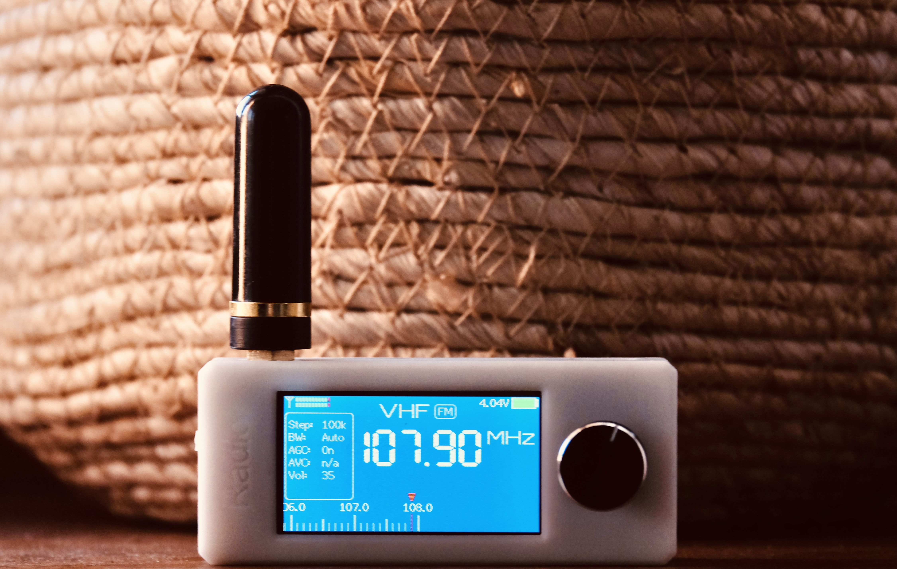

# ATS Mini — Stream Deck Remote Fork

> **Fork of [esp32-si4732/ats-mini](https://github.com/esp32-si4732/ats-mini)**
>
> This repository contains minimal additions to the serial remote API (`Remote.cpp`) to support the [ATS-Mini Stream Deck Plugin](https://github.com/soresore19xx/ats-mini).
> All changes are backward-compatible additions — no existing behavior was removed or altered.

---

## Why this fork exists

The upstream ATS-Mini firmware ships an excellent serial remote API.
A few small extensions were needed to drive a Stream Deck+ encoder display from macOS:

- **Direct frequency tuning across bands** — the original `F` command did not switch bands automatically or accept a mode parameter.
- **Hardware mute toggle** — needed for a dedicated mute button and dial long-press gesture.
- **LCD sleep / wake** — needed for a display toggle button.
- **AVC remote control** — needed to expose AVC gain in the Stream Deck Status Panel.
- **FM stereo indicator** — needed to show a STEREO badge on the encoder LCD.

See the [plugin README](https://github.com/soresore19xx/ats-mini#about-the-original-firmware) for the full rationale and diff details.

---

## Changes from upstream

All changes are in `ats-mini/Remote.cpp` (and `ats-mini/Common.h` for version bumps).

### Version history

> **upstream is at 233.** Versions 1234 and above are this fork only.
> If `git show upstream/main:ats-mini/Common.h | grep VER_APP` returns a number above 233, upstream has been updated — check for conflicts before rebasing.

| VER_APP | Changes |
|---------|---------|
| 233 | Upstream base (unchanged) |
| 1234 | This fork: `Q` mute toggle; `O`/`o` LCD sleep/wake; `F` command extended; `N`/`n` AVC control; status packet extended to 16 fields (AVC) |
| 1235 | This fork: status packet extended to 17 fields (FM stereo pilot) |

### `F{Hz}[,{mode}]\r` — direct frequency tune (replaced)

The original `remoteSetFrequency` accepted only `F{Hz}\n` with no mode parameter and no band switching.
Replaced with `remoteSetFreq`:

```
# Original
F{Hz}\n             no mode param, current band only

# This fork
F{Hz}[,{mode}]\r    optional mode, auto band-switch across all bands
```

Scans all bands for the target frequency and calls `tuneToMemory()`.

### `Q` — hardware mute toggle (new)

Calls `muteOn(MUTE_MAIN)` to toggle amplifier mute. Returns `Muted` / `Unmuted`.

### `O` / `o` — LCD sleep / wake (new)

`O` (uppercase) puts the display to sleep; `o` (lowercase) wakes it.

### `N` / `n` — AVC up / down (new)

Calls `doAvc(1)` / `doAvc(-1)`. Range: 12–90 dB in 2 dB steps. No-op in FM mode.

### Status packet — 16th field: AVC (added)

```
VER,freq,bfo,cal,band,mode,step,bw,agc,vol,rssi,snr,cap,volt,seq,avc
```

`avc`: current AVC max-gain index. `0` in FM mode.

### Status packet — 17th field: stereo (added, v1235)

```
VER,freq,bfo,cal,band,mode,step,bw,agc,vol,rssi,snr,cap,volt,seq,avc,stereo
```

`stereo`: `1` if FM stereo pilot detected (`rx.getCurrentPilot()`), `0` otherwise.

---

## Flashing (macOS)

### Prerequisites

| Tool | Install |
|------|---------|
| `~/bin/arduino-cli` | Download from [arduino/arduino-cli releases](https://github.com/arduino/arduino-cli/releases) — macOS binary, place in `~/bin/` |
| ESP32 board package | `arduino-cli core install esp32:esp32` |

### Hardware variant — choose the right profile

The ATS-Mini ships with two different PSRAM configurations. **Using the wrong profile will cause a boot failure.**

| Profile | PSRAM type | FQBN fragment |
|---------|-----------|---------------|
| `esp32s3-ospi` (default) | OPI (Octal) | `PSRAM=opi` |
| `esp32s3-qspi` | Quad SPI | `PSRAM=enabled` |

Most units use OPI PSRAM (`esp32s3-ospi`). If the device fails to boot after flashing, try the other profile.

### Serial port detection

```sh
# Confirm ATS-Mini is recognized
ls /dev/tty.usbmodem*
```

> Stop the Stream Deck plugin before flashing to release the serial port.

### Flash procedure

```sh
# Stop plugin, flash (default: esp32s3-ospi), restart plugin
streamdeck stop com.hogehoge.ats-mini
./scripts/flash.sh
streamdeck restart com.hogehoge.ats-mini

# For Quad SPI PSRAM variant:
./scripts/flash.sh esp32s3-qspi
```

[`scripts/flash.sh`](scripts/flash.sh) auto-detects the port, fetches origin, and skips flashing if the local repo is already up-to-date with `origin/main` and has no uncommitted changes.

### Force flash (ignore git state)

```sh
./scripts/flash-force.sh
# or: ./scripts/flash-force.sh esp32s3-qspi
```

### Post-flash checklist

1. **Power cycle** — turn the receiver off and back on (the hard-reset via RTS that arduino-cli performs is sometimes insufficient)
2. **USB Mode** — `Settings` → `USB Mode` → check the value; if it shows `OFF`, set it to **`Ad Hoc`**
3. Confirm plugin reconnects (LCD should come back within 5 s)

---

## Keeping up with upstream

```sh
git fetch upstream
git rebase upstream/main
# resolve any conflicts, then:
git push origin main --force-with-lease
```

---

## Original README



This firmware is for use on the SI4732 (ESP32-S3) Mini/Pocket Receiver

Based on the following sources:

* Volos Projects:    https://github.com/VolosR/TEmbedFMRadio
* PU2CLR, Ricardo:   https://github.com/pu2clr/SI4735
* Ralph Xavier:      https://github.com/ralphxavier/SI4735
* Goshante:          https://github.com/goshante/ats20_ats_ex
* G8PTN, Dave:       https://github.com/G8PTN/ATS_MINI

### Releases

Check out the [Releases](https://github.com/esp32-si4732/ats-mini/releases) page.

### Documentation

The hardware, software and flashing documentation is available at <https://esp32-si4732.github.io/ats-mini/>

### Discuss

* [GitHub Discussions](https://github.com/esp32-si4732/ats-mini/discussions) — the best place for feature requests, observations, sharing, etc.
* [TalkRadio Telegram Chat](https://t.me/talkradio/174172) — informal space to chat in Russian and English.

---

## Credits

All credit for the original firmware goes to the [esp32-si4732/ats-mini](https://github.com/esp32-si4732/ats-mini) project and its contributors:
PU2CLR (Ricardo Caratti), Volos Projects, Ralph Xavier, Sunnygold, Goshante, G8PTN (Dave), R9UCL (Max Arnold), Marat Fayzullin, and many others.
The serial remote API in `Remote.cpp` is particularly well-designed and made this Stream Deck integration possible.
