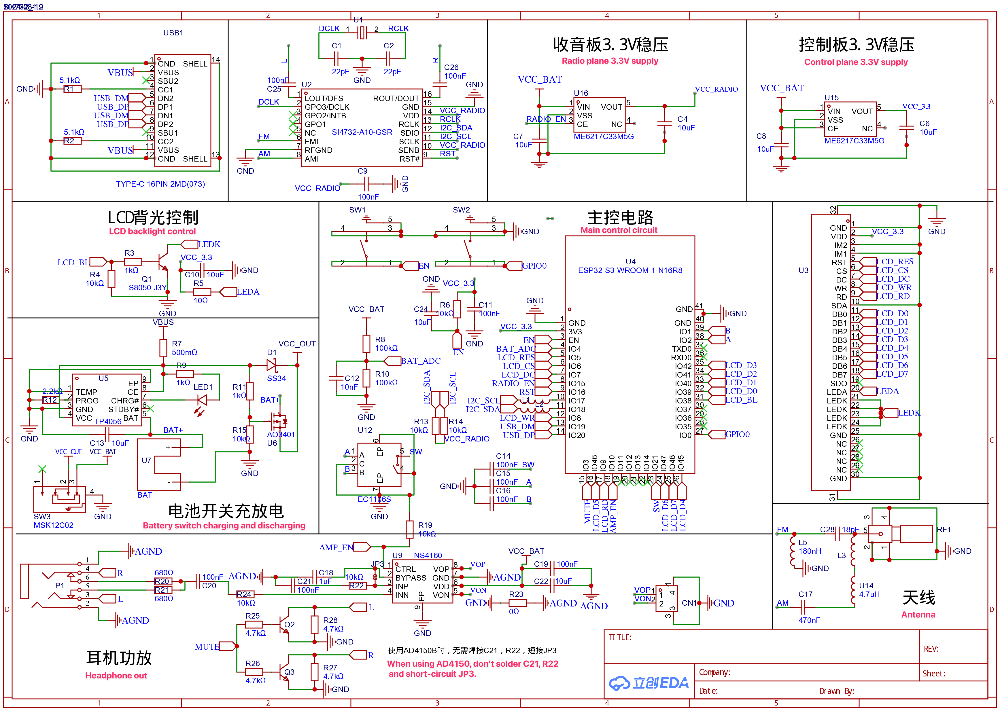
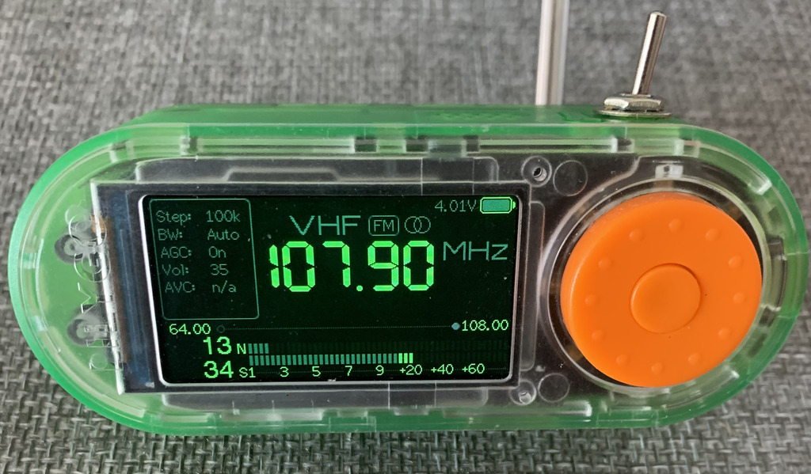
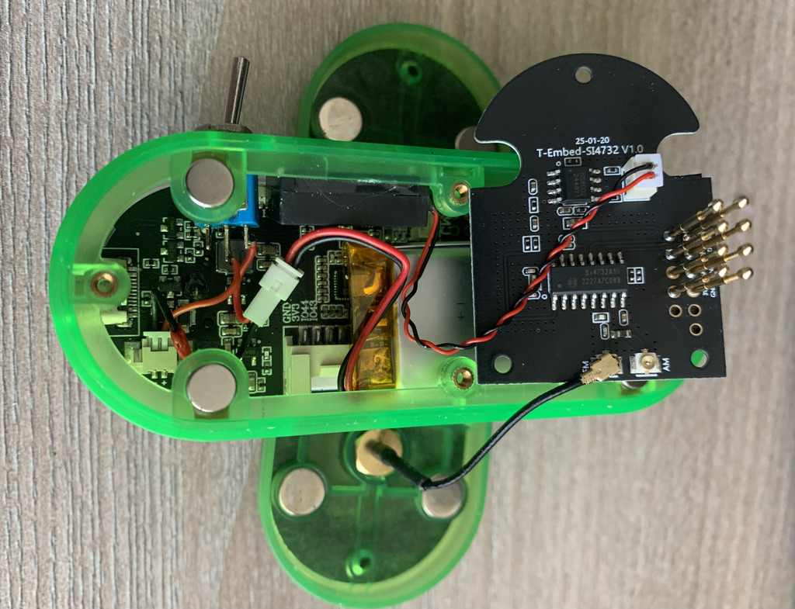

# Hardware notes

## Schematics

The original schematics, BOM and Gerber files can be found at <https://oshwhub.com/sunnygold/esp32s3-si4732-shou-yin-ji>. A copy of the files is available at <https://github.com/esp32-si4732/esp32-si4732-oshwhub>

No schematics available for other PCB versions currently sold, but you can find a brief overview [here](https://github.com/esp32-si4732/ats-mini/discussions/103#discussioncomment-13330603).

## Datasheets

* ESP32-S3-WROOM-1 [1](https://www.espressif.com/sites/default/files/documentation/esp32-s3-wroom-1_wroom-1u_datasheet_en.pdf), [2](https://www.espressif.com/sites/default/files/documentation/esp32-s3_datasheet_en.pdf) - MCU SoC
* SI4732-A10 [1](https://static.chipdip.ru/lib/035/DOC047035840.pdf), [2](https://www.skyworksinc.com/-/media/Skyworks/SL/documents/public/application-notes/AN383.pdf), [3](https://www.skyworksinc.com/-/media/Skyworks/SL/documents/public/application-notes/AN332.pdf), [4](https://aitendo3.sakura.ne.jp/aitendo_data/product_img/ic/radio/SI4732-A10/AN332.pdf), [5](https://github.com/pu2clr/SI4735/issues/2#issuecomment-703077550) - broadcast radio receiver
* [ST7789](https://www.buydisplay.com/download/ic/ST7789.pdf) - LCD controller (also see the [GC9307-XL](https://github.com/G8PTN/ATS_MINI/issues/1#issuecomment-2766901527) caveat)
* [GC9307](https://www.display-wiki.com/_media/knowledge_center/gc9307.pdf) - LCD controller
* [NS4160](https://www.lcsc.com/datasheet/lcsc_datasheet_2304140030_Shenzhen-Nsiway-Tech-NS4160_C219017.pdf) - audio amplifier
* [AD4150B](https://www.lcsc.com/datasheet/lcsc_datasheet_2208261700_IDCHIP-AD4150B_C5125078.pdf) - audio amplifier
* [ME6217](https://www.lcsc.com/datasheet/lcsc_datasheet_2410121326_MICRONE-Nanjing-Micro-One-Elec-ME6217C33M5G_C427602.pdf) - LDO regulator
* [TP4056](http://toppwr.com/uploadfile/file/20240130/65b892bb04a3c.pdf) - battery charge controller

## Pinout

The pinout table is shown below.

The relevant columns are ESP32-S3-WROOM-1 "Pin Name" and "ATS-Mini Sketch Pin Definitions"

| ESP32-S3-WROOM-1 Pin # | ESP32-S3-WROOM-1 Pin Name | ATS-MINI Sketch Pin Definitions | TFT_eSPI Pin Definition | xtronic.org Schematic | Comments Info         |
|---------------------------|------------------------------|------------------------------------|----------------------------|--------------------------|--------------------------|
| 1                         | GND                          |                                    |                            | GND                      |                          |
| 2                         | 3V3                          |                                    |                            | VCC_33                   |                          |
| 3                         | EN                           |                                    |                            | EN                       | RST Button               |
| 4                         | IO4                          | VBAT_MON                           |                            | BAT_ADC                  | Battery monitor          |
| 5                         | IO5                          |                                    | TFT_RST                    | LCD_RES                  |                          |
| 6                         | IO6                          |                                    | TFT_CS                     | LCD_CS                   |                          |
| 7                         | IO7                          |                                    | TFT_DC                     | LCD_DC                   |                          |
| 8                         | IO15                         | PIN_POWER_ON                       |                            | RADIO_EN                 | 1= Radio LDO Enable      |
| 9                         | IO16                         | RESET_PIN                          |                            | RST                      | SI4732 Reset             |
| 10                        | IO17                         | ESP32_I2C_SCL                      |                            | I2C_SCL                  | SI4732 Clock             |
| 11                        | IO18                         | ESP32_I2C_SDA                      |                            | I2C_SDA                  | SI4732 Data              |
| 12                        | IO8                          |                                    | TFT_WR                     | LCD_WR                   |                          |
| 13                        | IO19                         |                                    |                            | USB_DM                   | USB_D- (CDC Port)        |
| 14                        | IO20                         |                                    |                            | USB_DP                   | USB_D+ (CDC Port)        |
| 15                        | IO3                          | AUDIO_MUTE                         |                            | MUTE                     | 1 = Mute L/R audio       |
| 16                        | IO46                         |                                    | TFT_D5                     | LCD_DS                   |                          |
| 17                        | IO9                          |                                    | TFT_RD                     | LCD_RD                   |                          |
| 18                        | IO10                         | PIN_AMP_EN                         |                            | AMP_EN                   | 1 = Audio Amp Enable     |
| 19                        | IO11                         |                                    |                            | NC                       | Spare                    |
| 20                        | IO12                         |                                    |                            | NC                       | Spare                    |
| 21                        | IO13                         |                                    |                            | NC                       | Spare                    |
| 22                        | IO14                         |                                    |                            | NC                       | Spare                    |
| 23                        | IO21                         | ENCODER_PUSH_BUTTON                |                            | SW                       | Rotary encoder SW signal |
| 24                        | IO47                         |                                    | TFT_D6                     | LCD_D6                   |                          |
| 25                        | IO48                         |                                    | TFT_D7                     | LCD_D7                   |                          |
| 26                        | IO45                         |                                    | TFT_D4                     | LCD_D4                   |                          |
| 27                        | IO0                          |                                    |                            | GPIO0                    | BOOT button              |
| 28                        | IO35                         |                                    |                            | NC                       | Used for OSPI PSRAM      |
| 29                        | IO36                         |                                    |                            | NC                       | Used for OSPI PSRAM      |
| 30                        | IO37                         |                                    |                            | NC                       | Used for OSPI PSRAM      |
| 31                        | IO38                         | PIN_LCD_BL                         | TFT_BL                     | LCD_BL                   | Backlight control        |
| 32                        | IO39                         |                                    | TFT_D0                     | LCD_D0                   |                          |
| 33                        | IO40                         |                                    | TFT_D1                     | LCD_D1                   |                          |
| 34                        | IO41                         |                                    | TFT_D2                     | LCD_D2                   |                          |
| 35                        | IO42                         |                                    | TFT_D3                     | LCD_D2                   |                          |
| 36                        | RXD0                         |                                    |                            | NC                       | GPIO44                   |
| 37                        | TXD0                         |                                    |                            | NC                       | GPIO43                   |
| 38                        | IO2                          | ENCODER_PIN_A                      |                            | A                        | Rotary encoder A signal  |
| 39                        | IO1                          | ENCODER_PIN_B                      |                            | B                        | Rotary encoder B signal  |
| 40                        | GND                          |                                    |                            | GND                      |                          |
| 41                        | EPAD                         |                                    |                            | GND                      |                          |

## BOOT and RESET buttons

Some of the ESP32-SI4732 receivers do not have the BOOT and RESET buttons soldered in. You will need these buttons if you want to recover a receiver that was bricked because of a failed flashing process. Here is how to add the [BOOT & RESET](mods.md#boot-and-reset-buttons) buttons.

## LILYGO T-Embed SI4732

Impressions so far:

- Due to the lack of a power switch, the stock firmware uses deep sleep, triggered by a long press, but it still drains the battery. The ATS Mini firmware already uses the long-press gesture for other purposes, so there is no way to turn the receiver off.
- The reset button is external, and the boot button is combined with the encoder button. This makes triggering bootloader mode much easier, but it also means that to reset the receiver settings, you have to press and hold the encoder button right after powering the receiver on, not before.
- The display is connected via SPI, but the MISO pin is used for different purposes. This means the display controller registers are write-only.
- The display color palette is a bit off, so the themes look different.
- There are separate FM and AM antenna connectors on the SI4732 board.
- The encoder is nice, but the push-and-rotate gesture is harder to use.
- There is no headphone jack.
- The speaker is on the top.
- The antenna connector on the back cover can be used as a stand to tilt the receiver back.

It is highly recommended to do a little hardware mod and install a physical power switch (without it you won't be able to switch the receiver off after you flash the ATS Mini firmware):

Links:

* <https://lilygo.cc/products/t-embed-si4732> - product page
* <https://github.com/Xinyuan-LilyGO/LILYGO_wiki/blob/main/docs/get_started/en/Wearable/T-Embed-SI4732/T-Embed-SI4732.md> - wiki
* <https://github.com/Xinyuan-LilyGO/T-Embed/blob/main/schematic/> - schematic
* <https://github.com/Xinyuan-LilyGO/T-Embed/tree/main/examples/SI4735_Shield> - stock firmware source code
* <https://github.com/Xinyuan-LilyGO/T-Embed/blob/main/firmware/SI4735_Shield_250308.bin> - stock firmware binary
